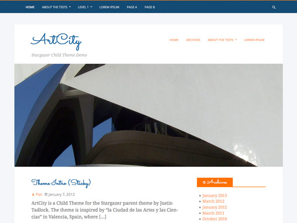

ArtCity
=======

###### Version 1.0
###### requires at least WordPress 3.6
###### tested up to 3.8
###### Author: [Piet Bos](https://github.com/senlin)

ArtCity Child Theme for the [Stargazer](http://themehybrid.com/themes/stargazer) parent theme by [Justin Tadlock](http://justintadlock.com).

Inspired by "la Ciudad de las Artes y las Ciencias" in Valencia, Spain

## Credits Header Images

All header images are photographs taken by the child theme author Piet Bos and are released under GNU Version 2 or Any Later Version

## License

* License: GNU Version 2 or Any Later Version
* License URI: http://www.gnu.org/licenses/gpl-2.0.html

## Donations

* Donate link: http://so-wp.com/donations

## Connect with me through

[Github](https://github.com/senlin) 

[Google+](http://plus.google.com/+PietBos) 

[WordPress](http://profiles.wordpress.org/senlin/) 

[Website](http://senlinonline.com)

## Changelog

### 1.0

* update after approval from WP.org

### 0.1.1

* edits according to theme review by Justin

### 0.1.0

* First release

## Screenshot

